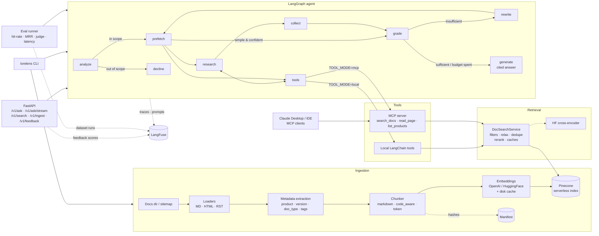

# LoreLens

**Agentic RAG search for technical documentation.**

LoreLens answers natural-language questions over large documentation sets (built for 10k+
pages) with cited answers. It ingests Markdown / HTML / reStructuredText (or crawls a
sitemap), chunks and embeds pages with a configurable pipeline, stores them in **Pinecone**
with filterable metadata (product, version, doc type, tags), and answers through a
**LangGraph** agent that plans searches, calls retrieval tools in-process or over **MCP**,
grades the evidence, rewrites queries when evidence is missing, and writes a cited answer.
**LangFuse** provides tracing, prompt management, user-feedback scores and offline evaluation.

**Stack:** Python 3.11, LangChain, LangGraph, MCP, Pinecone, OpenAI, HuggingFace
(sentence-transformers embeddings + cross-encoder reranker), FastAPI, LangFuse.

## Features

- **Ingestion pipeline**: directory and sitemap loaders, HTML/RST normalization, front-matter
  support; three chunking strategies (`markdown` header-aware, `code_aware` that keeps fenced
  code blocks intact, `token` windows); header breadcrumbs embedded with every chunk;
  incremental re-ingest through a content-hash manifest (unchanged pages skipped, stale chunks
  deleted, `--prune` for removed pages); embeddings cached on disk.
- **Pluggable embeddings**: OpenAI (`text-embedding-3-*`) or HuggingFace (`BAAI/bge-*`, etc.).
  The Pinecone index dimension follows the chosen model.
- **Retrieval**: metadata-filtered Pinecone search with progressive filter relaxation,
  per-section de-duplication, an optional HuggingFace cross-encoder reranker, and LRU/TTL caches
  for query embeddings and results.
- **Agent (LangGraph)**: query analysis (standalone rewrite, scope check, filters, sub-queries),
  parallel prefetch, a bounded tool-calling research loop (`search_docs`, `read_page`,
  `list_products`), relevance grading, query rewriting, and cited answer generation with
  per-node timings.
- **MCP**: the same tools are served by a FastMCP server (stdio or streamable HTTP), so the
  agent (with `LORELENS_TOOL_MODE=mcp`), Claude Desktop, or IDEs can all use the index.
- **API**: FastAPI with JSON and Server-Sent-Events streaming answers, raw search, background
  ingest jobs, feedback, optional API-key auth.
- **LangFuse**: a trace per question covering every node, LLM call and tool call; prompts
  fetched by label with local fallbacks; thumbs up/down feedback stored as scores; eval runs
  logged as dataset runs with retrieval and LLM-judge scores.

### Latency

The first retrieval pass skips the LLM tool-calling round trip: planned sub-queries run in
parallel straight through the search tool. Simple, high-confidence questions go directly to
grading. The fast model handles analysis, grading and rewriting, and the stronger model only
writes the final answer. Query embeddings and retrieval results are cached. `lorelens eval`
reports p50/p95 latency and mean latency per node, so you can measure each change.

## Architecture



### Project layout

```
src/lorelens/
  config.py            typed settings (env / .env)
  models.py            shared schemas (chunks, filters, citations, answers)
  embeddings.py        OpenAI / HuggingFace embedding factory + cache
  vectorstore.py       Pinecone wrapper
  ingestion/           loaders, metadata, chunking, manifest, pipeline
  retrieval/           DocSearchService, reranker, caches
  tools/               tool core, local LangChain tools, MCP client loader
  mcp_server.py        FastMCP server
  agent/               state, nodes, graph, prompts, LLM factory
  observability.py     LangFuse tracing, prompts, scores
  api/                 FastAPI app, routes, schemas, deps
  evals/               dataset, metrics, LLM judge, runner
  cli.py               `lorelens` command
data/sample_docs/      small multi-product, multi-version corpus
data/eval/             sample QA evaluation set
tests/                 offline unit + graph + API tests
```

## Getting started

### Prerequisites

- Python 3.11+
- An OpenAI API key
- A Pinecone API key (serverless; the index is created automatically)
- Optional: LangFuse keys (cloud or self-hosted) for tracing, prompts and evals

### Install

```bash
python -m venv .venv && source .venv/bin/activate
pip install -e ".[dev]"            # add ,huggingface for HF embeddings / reranker
cp .env.example .env               # fill in OPENAI_API_KEY, PINECONE_API_KEY, ...
```

### Ingest documentation

```bash
# the bundled sample corpus
lorelens ingest data/sample_docs --base-url https://docs.example.com

# your own docs directory, or a site via its sitemap
lorelens ingest ./my-docs --base-url https://docs.mycompany.com
lorelens ingest --sitemap https://docs.mycompany.com/sitemap.xml --include "/docs/"

# re-run any time: unchanged pages are skipped; --prune removes deleted pages
lorelens ingest ./my-docs --prune
lorelens stats
```

To switch chunking or embeddings, set `LORELENS_CHUNK_STRATEGY` or
`LORELENS_EMBEDDING_PROVIDER`. Changing the embedding model needs a different
`LORELENS_PINECONE_INDEX` because the vector dimension changes.

### Ask questions (CLI)

```bash
lorelens search "token expiry" --product nimbus --version v2      # raw retrieval, no LLM
lorelens ask "How long does a Nimbus v2 access token last?" --show-trace
lorelens ask "Compare auth in v1 and v2" --mode mcp               # tools over MCP
```

### Run the API

```bash
lorelens serve            # or: uvicorn lorelens.api.app:app --reload
```

```bash
curl -s localhost:8000/v1/ask -H 'content-type: application/json' \
  -d '{"question": "What is the API rate limit?", "include_sources": true}'

# streaming (SSE events: status, token, done)
curl -N localhost:8000/v1/ask/stream -H 'content-type: application/json' \
  -d '{"question": "How do I upload large files?"}'

# feedback on an answer (stored as a LangFuse score on its trace)
curl -s localhost:8000/v1/feedback -H 'content-type: application/json' \
  -d '{"trace_id": "<trace_id from /v1/ask>", "score": 1}'

# background ingest of a directory under LORELENS_INGEST_ROOT (default ./data)
curl -s localhost:8000/v1/ingest -H 'content-type: application/json' -d '{"path": "sample_docs"}'
```

If `LORELENS_API_KEY` is set, every `/v1/*` request must send `X-API-Key`. Interactive docs
are served at `http://localhost:8000/docs`.

### Run the MCP server

```bash
python -m lorelens.mcp_server                                   # stdio
python -m lorelens.mcp_server --transport streamable-http --port 8765
```

Claude Desktop config example:

```json
{
  "mcpServers": {
    "lorelens": {
      "command": "python",
      "args": ["-m", "lorelens.mcp_server"],
      "env": { "OPENAI_API_KEY": "...", "PINECONE_API_KEY": "..." }
    }
  }
}
```

To make the agent use a remote MCP server instead of spawning one, set
`LORELENS_TOOL_MODE=mcp` and `LORELENS_MCP_SERVER_URL=http://localhost:8765/mcp`.

### Docker

```bash
docker compose up --build      # API on :8000, MCP (streamable HTTP) on :8765
```

## LangFuse: tracing, prompts and evaluation

1. Set `LANGFUSE_PUBLIC_KEY`, `LANGFUSE_SECRET_KEY` and `LANGFUSE_HOST`. Every CLI and API
   question then becomes a trace with nested spans for each graph node, LLM call and tool call.
   The trace id is returned as `trace_id`.
2. Push the bundled prompts and edit them in the LangFuse UI:
   `lorelens push-prompts` (or `python scripts/push_prompts.py`). The agent fetches prompts by
   label (`LORELENS_PROMPT_LABEL`, default `production`) and caches them for 60s. If LangFuse
   is unreachable, it uses the local prompts.
3. Run evaluations as LangFuse dataset runs to compare prompt versions, chunking strategies
   or retrieval settings:

```bash
lorelens eval --langfuse-dataset lorelens-qa --run-name chunk-markdown-512
LORELENS_CHUNK_STRATEGY=code_aware lorelens eval --langfuse-dataset lorelens-qa --run-name code-aware
```

## Testing

The test suite runs fully offline. It needs no API keys, no Pinecone and no network. Scripted
fake LLMs and a fake search service drive the real LangGraph graph, the real local tools and
the real FastAPI app.

```bash
pip install -e ".[dev]"
pytest -q                     # or: make test
ruff check src tests          # lint
```

`tiktoken` downloads its `cl100k_base` encoding on first use and caches it, so run the tests
once with network access or pre-populate `TIKTOKEN_CACHE_DIR`.

What is covered:

| Test file | Covers |
|---|---|
| `tests/test_chunking.py` | header breadcrumbs, code-block preservation, oversized code re-fencing, token budgets |
| `tests/test_metadata.py` | product / version / doc-type detection, front-matter overrides |
| `tests/test_loaders.py` | HTML/RST normalization, directory loading of the sample corpus |
| `tests/test_models.py` | Pinecone metadata filter construction |
| `tests/test_metrics.py` | hit-rate@k, MRR, recall, citation precision, percentiles |
| `tests/test_agent_graph.py` | fast path, tool-calling research, bounded rewrites, filter overrides, out-of-scope, streaming |
| `tests/test_api.py` | ask / search / feedback endpoints, API-key auth, ingest path validation |

### End-to-end quality evaluation (live services)

With real keys and the sample corpus ingested:

```bash
lorelens ingest data/sample_docs --base-url https://docs.example.com
lorelens eval --dataset data/eval/sample_eval.jsonl --output reports/eval_report.json
```

The report includes hit-rate@k, MRR, recall, citation precision, LLM-judge faithfulness,
correctness and completeness, grounded rate, average rewrites and tool calls, p50/p95
latency and mean latency per node. To add your own examples, append JSONL lines with
`question`, `expected_answer` and `expected_sources` (source paths as stored at ingest).

## Configuration reference

All settings come from environment variables or `.env`. See `.env.example` for the full list.
The most important ones:

| Variable | Default | Purpose |
|---|---|---|
| `LORELENS_EMBEDDING_PROVIDER` | `openai` | `openai` or `huggingface` |
| `LORELENS_CHUNK_STRATEGY` | `markdown` | `markdown`, `code_aware`, `token` |
| `LORELENS_CHUNK_SIZE` / `_OVERLAP` | `512` / `64` | chunk budget in tokens |
| `LORELENS_TOP_K` / `_CANDIDATE_K` | `8` / `24` | final chunks / Pinecone candidates |
| `LORELENS_RERANK_ENABLED` | `false` | HF cross-encoder reranking |
| `LORELENS_TOOL_MODE` | `local` | `local` or `mcp` tool transport |
| `LORELENS_MAX_REWRITES` / `_MAX_TOOL_CALLS` | `2` / `6` | agent loop budgets |
| `LORELENS_CHAT_MODEL` / `_FAST_MODEL` | `gpt-4o` / `gpt-4o-mini` | answer / utility models |

## License

MIT
